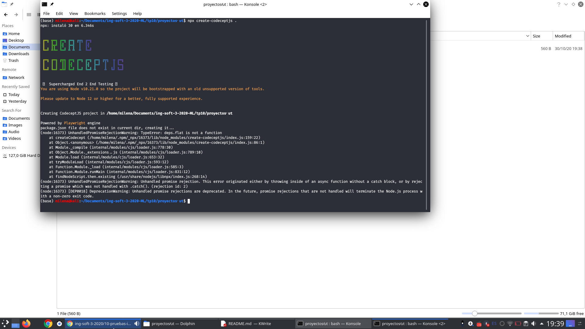
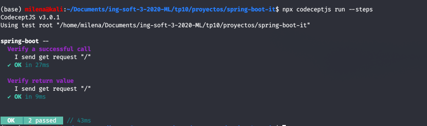

# Trabajo Práctico 10 - Pruebas de Integración

## Desarrollo:



- Escribir un escenario de prueba:

```Feature('My First Test');

Scenario('test something', (I) => {
  I.amOnPage('https://github.com');
  I.see('GitHub');
});
```

- Finalmente correr el test:
```npx codeceptjs run --steps```

- Agregamos otras validaciones
```javascript
Scenario('test something', ({ I }) => {
    I.amOnPage('https://github.com');
    I.see('GitHub');
    I.see('Built for developers')
    I.scrollPageToBottom()
    I.seeElement("//li[contains(.,'© 2020 GitHub, Inc.')]")
});
```
  
#### Testeando la aplicación spring-boot

- Editar el archivo generado `spring-boot_tests.js`:

```javascript
Feature('spring-boot');

const expect = require('chai').expect;
const {I} = inject();

Scenario('Verify a successful call', async () => {
	const res = await I.sendGetRequest('/');
	expect(res.status).to.eql(200);
});

Scenario('Verify return value', async () => {
	const res = await I.sendGetRequest('/');
	//console.log(res);
	expect(res.data.message).to.eql('Spring boot says hello from a Docker container');
});
```

- Reemplazar la sección helpers de codecept.conf.js por:
```javascript
	helpers: {
		REST: {
			endpoint: "http://localhost:8080",
			onRequest: () => {
			}
		}
	}
```

- Levantar la aplicación spring-boot en otra consola (usando java o Docker):

```bash
cd ./proyectos/spring-boot
java -jar target/spring-boot-sample-actuator-2.0.2.jar
```
- Ejecutar los tests desde la carpeta `.\proyectos\spring-boot-it`

```
npx codeceptjs run --steps
```


#### Habilitar reportes para utilizarlos en CICD
- Instalar el módulo para reporting
```bash
npm i mocha-junit-reporter mocha-multi --save
```
- Reemplazar la key mocha en el archivo codecept.conf.js por:

```javascript
	mocha:  {
    "reporterOptions": {
      "codeceptjs-cli-reporter": {
        "stdout": "-",
        "options": {
          "steps": true,
        }
      },
      "mocha-junit-reporter": {
        "stdout": "./output/console.log",
        "options": {
          "mochaFile": "./output/result.xml"
        },
        "attachments": true //add screenshot for a failed test
		  }
		}
	}
```

- Ejecutar los tests nuevamente
```bash
npx codeceptjs run --steps --reporter mocha-multi
```


 
- La salida compatible con Jenkins esta en ./output/results.xml

#### Integrar la ejecución en Jenkins

~~~groovy
pipeline {
    agent any

    tools {
        nodejs "node"
        maven "M3"
    }

    environment { 
        registry = "milelucero98/spring-boot" 
        registryCredential = 'docker-hub-credentials' 
    }
    
    stages {
        stage('Clone Git') {
            steps {
                git 'https://github.com/MilenaL2018/spring-boot.git'
            }
        }
        
        stage('Build image') {
            steps {
                script {
                    dockerImage = docker.build registry + ":$BUILD_NUMBER"
                }
            }
        }
        
        stage('Deploy image') {
            steps {
                script {
                    docker.withRegistry( '', registryCredential ) {
                        dockerImage.push()
                    }
                }
            }
        }
        
        stage('Prepare tests') {
            steps{
                sh script:'''
                  #!/bin/bash
                  mvn -Dmaven.test.failure.ignore=true clean package
                  cd ./it
                  npm install
                '''
            }
        }
        
        stage('Tests') {
            steps {
                sh script:'''
                  #!/bin/bash
                  java -jar target/spring-boot-sample-actuator-2.0.2.jar &
                  sleep 10
                  cd ./it
                  npx codeceptjs run --steps --reporter mocha-multi
                '''
            }
            
            post {
                success {
                    junit '**/output/*.xml'
                }
            }
        }
        
        stage('Push image') {
            steps {
                withCredentials([usernamePassword( credentialsId: 'docker-hub-credentials', usernameVariable: 'USERNAME', passwordVariable: 'PASSWORD')]) {
                    script {
                        docker.withRegistry('', 'docker-hub-credentials') {
                            sh "docker login -u ${USERNAME} -p ${PASSWORD}"
                            sh "docker push $registry:$BUILD_ID"
                        }   
                    }
                }   
            }
        }
    }
}

