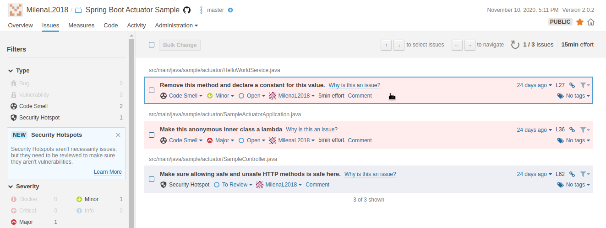

## Trabajo Práctico 11 - Métricas de código

### Desarrollo:

#### Correr Análisis de código
  - Una vez creado el proyecto, se debe elegir la opción de análisis manual
  - Seleccionar Maven.
  - Correr el siguente comando en la raíz del repositorio clonado, hay que agregar la opción `-Dmaven.test.failure.ignore=true` y/o `-Dsonar.scanner.force-deprecated-java-version=true` (para java 1.8) final del comando, algo similar a esto:
```bash
mvn sonar:sonar \
  -Dsonar.projectKey=alexisfr_java-projects \
  -Dsonar.organization=alexisfr-github \
  -Dsonar.host.url=https://sonarcloud.io \
  -Dsonar.login=<SONAR_TOKEN> \
  -Dmaven.test.failure.ignore=true \ 
  -Dsonar.scanner.force-deprecated-java-version=true
```

#### Analizar los resultados de Fiabilidad
  - Encontrar los 3 Bugs en la clase **basics/swing/FileIO** referidos a Fiabilidad (Reliability).
  - Explicar porque se consideran errores y posible solución a los mismos.
  
  - FileOutputStream out = new FileOutputStream(outputFileName);
  - Problema: ante un error, puede quedar accidentalmente abierto y si luego se intenta entrar al archivo, se rompe toda la app. 
  - Solución: Usar Finally, siempre se cierra el stream.
  
  - FileInputStream in = new FileInputStream(inputFile);
  - Problema: el mismo planteado anteriormente. 
  - Solución: utilizar try-with-resources o cierrar este "FileInputStream" en una cláusula "finalmente".
  
  -  in.read(bt);
  - Problema: plantea un problema cuando se llama a un método InputStream.read que acepta un byte [], pero el valor de retorno no está verificado y cuando el valor de retorno de InputStream.skip no está verificado.
  - Solución: se debe verificar el valor devuelto por el método de lectura para ver cuántos bytes se leyeron.
  
#### Analizar las Vulnerabilidades de Seguridad
  - Encontrar los 4 Errores de seguridad en la clase **basics/jdbc/mysql/MySQLAccess.java**
  - Explicar porque se considera código vulnerable y posible solución a los mismos.
  
  - String password = "root";
  - Problema: las credenciales no deben estar hardcodeadas. Esto es especialmente problemático para las aplicaciones distribuidas o de código abierto.
  - Solución: esconder información sensible, codificándola. 
  
  - E.printStackTrace();
  - Problema: La entrega de código en producción con las funciones de depuración activadas es una cuestión de seguridad, muestra información sensible. 
  - Solución: función de depuración esté desactivada antes de entregar el código en producción. 
  
  - this.connect = DriverManager.getConnection(url, userName, password);
  - Problema: as credenciales no deben estar codificadas. 
  - Solución: eliminar esta contraseña codificada, pasar credenciales. 
  
  -  e.printStackTrace(); (El mismo problema planteado anteriormente)

#### Analizar costo de Mantenimiento
  - Code Smells: hay dos bloques de codigo repetido y la clase Calculator hereda de 6 clases, y la regla 5. 
  
  - ¿Cuánto tiempo estimado es necesario para llevar esta clase de calificación **B** a calificación **A** de acuerdo a esta herramienta?  1 día y seis horas. 


#### 6- Analizar Complejidad
  - Encontrar la función que posee la mayor complejidad ciclomática en la clase basics/xml/EvalXML.java
  
  ```
  private int factor(final Node root) {
        int rslt = 0;
        String tagName = root.getLocalName();
        if (tagName.equals(TokenType.IDENT.toString()) || tagName.equals(TokenType.INT.toString())) {
            NodeList children = root.getChildNodes();
            if (children.getLength() == 1) {
                Node child = children.item(0);
                if (child.getNodeType() == Node.TEXT_NODE) {
                    Text textNode = (Text) child;
                    String textData = textNode.getData();
                    if (tagName.equals(TokenType.IDENT.toString())) {
                        rslt = this.symbolLookup(textData);
                    } else {
                        try {
                            rslt = Integer.parseInt(textData);
                        } catch (NumberFormatException e) {
                            logger.info("factor: bad format for number \"" + textData + "\"");
                        }
                    }
                } else {
                    logger.info("factor: unexpected node type = " + this.nodeTypeToString(child.getNodeType()));
                }
            } else {
                logger.info("factor: 1 child expected for " + tagName + ", got " + children.getLength() + " children");
            }
        } // root is not an IDENT or an INT, so it should be an expression
        else if (tagName.equals(TokenType.PAREN.toString())) {
            ArrayList<Node> children = this.toElementNodeList(root.getChildNodes());
            if (children.size() == 1) {
                Node expr = children.get(0);
                rslt = this.addExp(expr);
            } else {
                logger.info("factor: extra children of PAREN");
            }
        } else {
            logger.info("factor: Unexpected tag = " + tagName);
        }
        return rslt;
    } // factor
```
    
  - ¿Qué significa complejidad ciclomática y complejidad cognitiva?
  
 - Complejidad ciclomatica: 
Esta métrica mide el número de flujos distintos de ejecución que puede tener el código de un artefacto de software, dicho llanamente, nos dice cuantos ifs-then-else, while, for, switch…etc, tenemos en nuestro código.
Nos va a dar una medida cuantitativa de como de complejo va a ser comprender el código analizado. A más complejidad ciclomática, más complejo será el código, más complicado de leer, de entender, de modificar, de mantener y, por lo tanto, más caro.

 - Complejidad cognitiva:
Es una medida de cómo es de difícil entender intuitivamente un bloque de código. 
Mantenibilidad del mismo, es decir, como es de bueno un algoritmo para que una persona interactúe con él en su mantenimiento. 
  
  - ¿Cuánto son los valores para esta clase?  24 

#### Incluir el analisis en el Pipeline
  - Agregar el paso de análisis automático de código en Jenkins u otra herramienta de CI/CD para el proyecto  **./proyectos/spring-boot**

  stage('Análisis estático') {
            steps {
                sh 'mvn sonar:sonar -Dsonar.projectKey=MilenaL2018_spring-boot -Dsonar.organization=milenal2018 -Dsonar.host.url=https://sonarcloud.io -Dmaven.test.failure.ignore=true -Dsonar.scanner.force-deprecated-java-version=true'
            }
}


