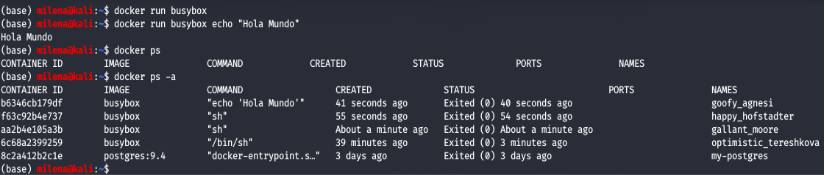
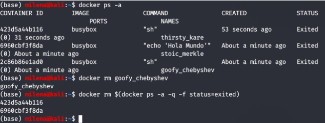
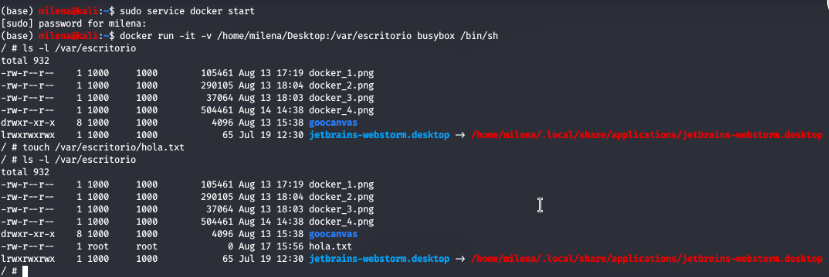
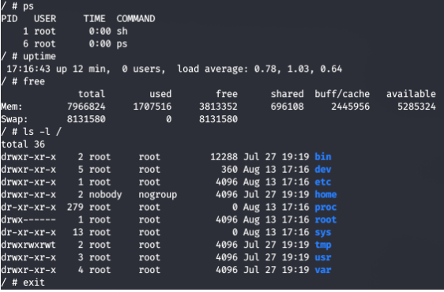
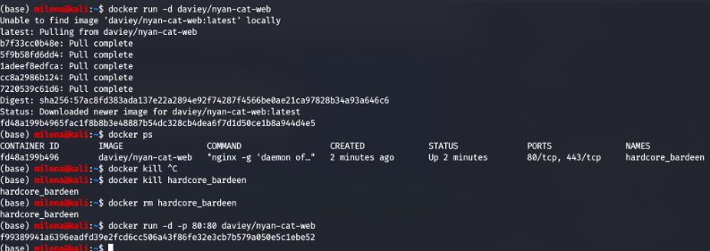
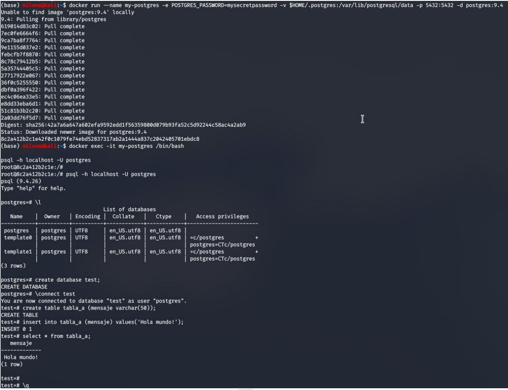

## Trabajo Práctico 2 - Introducción a Docker

## Desarrollo:

#### Instalar Docker Community Edition 
  - Diferentes opciones para cada sistema operativo
  - https://docs.docker.com/
  - Ejecutar el siguiente comando para comprobar versiones de cliente y demonio.
```bash
docker version
```


#### 2- Explorar DockerHub
   - Registrase en docker hub: https://hub.docker.com/


#### 3- Obtener la imagen BusyBox
  - Ejecutar el siguiente comando, para bajar una imagen de DockerHub
  ```bash
  docker pull busybox
  ```
  - Verificar qué versión y tamaño tiene la imagen bajada, obtener una lista de imágenes locales:
```bash
docker images
```


#### 4- Ejecutando contenedores
  - Ejecutar un contenedor utilizando el comando **run** de docker:
```bash
docker run busybox
```


  - Explicar porque no se obtuvo ningún resultado
  
No hay resultados porque no se expuso el puerto, por lo que no se puede acceder al contenedor. 

  - Especificamos algún comando a correr dentro del contendor, ejecutar por ejemplo:
```bash
docker run busybox echo "Hola Mundo"
```


  - Ver los contendores ejecutados utilizando el comando **ps**:
```bash
docker ps
```


  - Vemos que no existe nada en ejecución, correr entonces:
```bash
docker ps -a
```



  - Mostrar el resultado y explicar que se obtuvo como salida del comando anterior.
  
Lo que se obtuvo es un listado de los contenedores activos, con información relevante sobre ellos: container id, imagen, comando, cuándo fue creado, el estado, los puertos y el nombre. 

#### 5- Ejecutando en modo interactivo

  - Ejecutar el siguiente comando
```bash
docker run -it busybox sh
```


  - Para cada uno de los siguientes comandos dentro de contenedor, mostrar los resultados:
```bash
ps
uptime
free
ls -l /
```
  - Salimos del contendor con:
```bash
exit
```



#### 6- Borrando contendores terminados

  - Obtener la lista de contendores 
```bash
docker ps -a
```
  - Para borrar podemos utilizar el id o el nombre (autogenerado si no se especifica) de contendor que se desee, por ejemplo:
```bash
docker rm elated_lalande
```
  - Para borrar todos los contendores que no estén corriendo, ejecutar cualquiera de los siguientes comandos:
```bash
docker rm $(docker ps -a -q -f status=exited)
```
```bash
docker container prune
```



#### 7- Montando volúmenes

Hasta este punto los contenedores ejecutados no tenían contacto con el exterior, ellos corrían en su propio entorno hasta que terminaran su ejecución. Ahora veremos cómo montar un volumen dentro del contenedor para visualizar por ejemplo archivos del sistema huésped:

  - Ejecutar el siguiente comando, cambiar myusuario por el usuario que corresponda. En linux/Mac puede utilizarse /home/miusuario):
```bash
docker run -it -v C:\Users\misuario\Desktop:/var/escritorio busybox /bin/sh
```
  - Dentro del contenedor correr
```bash
ls -l /var/escritorio
touch /var/escritorio/hola.txt
```


#### 8- Publicando puertos

En el caso de aplicaciones web o base de datos donde se interactúa con estas aplicaciones a través de un puerto al cual hay que acceder, estos puertos están visibles solo dentro del contenedor. Si queremos acceder desde el exterior deberemos exponerlos.

  - Ejecutar la siguiente imagen, en este caso utilizamos la bandera -d (detach) para que nos devuelva el control de la consola:

```bash
docker run -d daviey/nyan-cat-web
```
  - Si ejecutamos un comando ps:
```bash
PS D:\> docker ps
CONTAINER ID        IMAGE                 COMMAND                  CREATED             STATUS              PORTS               NAMES
87d1c5f44809        daviey/nyan-cat-web   "nginx -g 'daemon of…"   2 minutes ago       Up 2 minutes        80/tcp, 443/tcp     compassionate_raman
```
  - Vemos que el contendor expone 2 puertos el 80 y el 443, pero si intentamos en un navegador acceder a http://localhost no sucede nada.

  - Procedemos entonces a parar y remover este contenedor:
```bash
docker kill compassionate_raman
docker rm compassionate_raman
```
  - Vamos a volver a correrlo otra vez, pero publicando uno de los puertos solamente, el este caso el 80

```bash
docker run -d -p 80:80 daviey/nyan-cat-web
```
Lo que hicimos es publicar el puerto 80 para que nosotros podamos acceder a ese container desde afuera.
Al agregar la flag -p 80:80, indicamos que se debe unir el puerto 80 al container que se está ejecutando. Es por eso que después de este comando, podemos ver el resultado en el localhost.
-p abre cada puerto que el contenedor expone. No conviene hacerlo, por lo que se especifica el puerto que se quiere (80:80 en este caso). Por default, Docker expone los 
puertos del contenedor a la dirección IP 0.0.0.0. 

#### 9- Utilizando una base de datos
- Levantar una base de datos PostgreSQL

```bash
mkdir $HOME/.postgres

docker run --name my-postgres -e POSTGRES_PASSWORD=mysecretpassword -v $HOME/.postgres:/var/lib/postgresql/data -p 5432:5432 -d postgres:9.4
```
- Ejecutar sentencias utilizando esta instancia

```bash
docker exec -it my-postgres /bin/bash

psql -h localhost -U postgres

#Estos comandos se corren una vez conectados a la base

\l
create database test;
\connect test
create table tabla_a (mensaje varchar(50));
insert into tabla_a (mensaje) values('Hola mundo!');
select * from tabla_a;

\q

exit
```

- Conectarse a la base utilizando alguna IDE.


- Explicar que se logro con el comando `docker run` y `docker exec` ejecutados en este ejercicio.

Docker run: ​manipula imágenes que existen o accesibles desde localhost. Cuando se
utiliza "docker run", se crea un contenedor de la ventana acoplable temporal y se detiene
(no finaliza) una vez que el comando ha terminado de ejecutarse.

Docker exec:​ opera un contenedor docker existente. Necesita un contenedor en ejecución
para ejecutar el comando.


 
