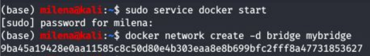

## Trabajo Práctico 3 - Arquitectura de Sistemas Distribuidos
#### 1- Sistema distribuido simple 
  - Ejecutar el siguiente comando para crear una red en docker
  ```bash
  docker network create -d bridge mybridge
  ```
  
  
  - Instanciar una base de datos Redis conectada a esa Red.
  ```bash
   docker run -d --net mybridge --name db redis:alpine
   ```
   
   
  - Levantar una aplicacion web, que utilice esta base de datos
  ```bash
    docker run -d --net mybridge -e REDIS_HOST=db -e REDIS_PORT=6379 -p 5000:5000 --name web alexisfr/flask-app:latest
  ```
  
  
  - Abrir un navegador y acceder a la URL: http://localhost:5000/
  - Verificar el estado de los contenedores y redes en Docker, describir:
    - ¿Cuáles puertos están abiertos? Los puertos abiertos son 5000 y 6379
    - Mostrar detalles de la red `mybridge` con Docker. 
    - ¿Qué comandos utilizó? `​docker network inspect mybridge`
    
 

#### 2- Análisis del sistema 
  - Siendo el código de la aplicación web el siguiente:
```python
import os

from flask import Flask
from redis import Redis


app = Flask(__name__)
redis = Redis(host=os.environ['REDIS_HOST'], port=os.environ['REDIS_PORT'])
bind_port = int(os.environ['BIND_PORT'])


@app.route('/')
def hello():
    redis.incr('hits')
    total_hits = redis.get('hits').decode()
    return f'Hello from Redis! I have been seen {total_hits} times.'


if __name__ == "__main__":
    app.run(host="0.0.0.0", debug=True, port=bind_port)
```
  - Explicar cómo funciona el sistema. 
  El sistema consiste de una app web que cuenta la cantidad de veces que se ha ingresado a la aplicación y guarda el valor en una base de datos, para poder mostrarle al usuario dicho valor en un mensaje.
  - ¿Para qué se sirven y porque están los parámetros `-e` en el segundo Docker run del ejercicio 1?
    ​-e ​indica las variables de entorno
    -e REDIS_HOST=db Indica que el container donde corre la app web está relacionada con el container db.
    -e REDIS_PORT=6379 Indica que el puerto a utilizar para la comunicación con db es a través del puerto 6379.

  - ¿Qué pasa si ejecuta `docker rm -f web` y vuelve a correr ` docker run -d --net mybridge -e REDIS_HOST=db -e REDIS_PORT=6379 -p 5000:5000 --name web alexisfr/flask-app:latest` ?
  Salta un error, porque no puede encontrar el container web. 
  
  - ¿Qué occure en la página web cuando borro el contenedor de Redis con `docker rm -f db`?
  Cuando eliminamos el container db, nos puestra un error porque la web app intenta conectarse al primero y no puede.
 
   

  - Y si lo levanto nuevamente con `docker run -d --net mybridge --name db redis:alpine` ?
  Se pierde la cantidad de visitas acumulada anteriormente.
  
  - ¿Qué considera usted que haría falta para no perder la cuenta de las visitas?
  Para no perder la cuenta de las visitas, asociaría la app web al sistema de archivos de la computadora, para persistir el último valor registrado. Si se borra bd y luego se levanta, podemos consultar el valor en el sistema de archivos y arrancar a partir de esa cuenta.

  
  - Para eliminar los elementos creados corremos:
  ```bash
  docker rm -f db
  docker rm -f web
  docker network rm mybridge
  ```
  
#### 3- Utilizando docker compose 
  - Normalmente viene como parte de la solucion cuando se instaló Docker
  - De ser necesario instalarlo hay que ejecutar:
  ```bash
  sudo pip install docker-compose
  ```
  - Crear el siguente archivo `docker-compose.yaml` en un directorio de trabajo:
  ```yaml
version: '3.6'
services:
  app:
    image: alexisfr/flask-app:latest
    depends_on:
      - db
    environment:
      - REDIS_HOST=db
      - REDIS_PORT=6379
    ports:
      - "5000:5000"
  db:
    image: redis:alpine
    volumes:
      - redis_data:/data
volumes:
  redis_data: 
  ```
  - Ejecutar `docker-compose up -d`
  - Acceder a la url http://localhost:5000/
  - Ejecutar `docker ps`, `docker network ls` y `docker volume ls`
  - ¿Qué hizo **Docker Compose** por nosotros? Explicar con detalle.
  Docker Compose nos ahorra el trabajo de realizar las tareas que hicimos previamente para configurar aplicaciones conformadas por múltiples contenedores. Cuando ejecutamos el comando ​docker-compose up -d, ​Docker Compose toma nuestro archivo ​docker-compose.yml ​y levanta todos los servicios definidos de forma insolada, para que nuestra aplicación funcione.

  - Desde el directorio donde se encuentra el archivo `docker-compose.yaml` ejecutar:
  ```bash
  docker-compose down
  ```
 
#### 4- Análisis de otro sistema distribuido.
Este es un sistema compuesto por:

- Una aplicación web de Python que te permite votar entre dos opciones
- Una cola de Redis que recolecta nuevos votos
- Un trabajador .NET o Java que consume votos y los almacena en...
- Una base de datos de Postgres respaldada por un volumen de Docker
- Una aplicación web Node.js que muestra los resultados de la votación en tiempo real.

Pasos:
- Clonar el repositorio https://github.com/dockersamples/example-voting-app
- Abrir una línea de comandos y ejecutar

```bash
cd example-voting-app
docker-compose -f docker-compose-javaworker.yml up -d
```
- Una vez terminado acceder a http://localhost:5000/ y http://localhost:5001
- Emitir un voto y ver el resultado en tiempo real.
- Para emitir más votos, abrir varios navegadores diferentes para poder hacerlo
- Explicar como está configurado el sistema, puertos, volumenes componenetes involucrados, utilizar el Docker compose como guía.

vote
Puertos: 5000:80
Volumes: ./vote:/app
Redes: front-tier y back-tier
Lenguaje: Python

result
Puertos: 5001:80 y 5858:5858
Volumes: ./result:/app
Redes: front-tier y back-tier
Lenguaje: Node.js

worker
Dependencias: redis y db.
Redes: back-tier
Lenguaje: Java
Contexto: ./worker

redis:
Puertos: 6379
Redes: back-tier
Imagen; redis:alpine
Nombre de contenedor: redis

db
Imagen: postgres:9.4
Nombre de contenedor: db
Volumes: bd-data
Redes: front-tier y back-tier
Variables de entorno:
POSTGRES_USER: "postgres"
POSTGRES_PASSWORD: "postgres"
Volumes: db-data:/var/lib/postgresql/data


#### 5- Análisis detallado
- Exponer más puertos urtos para ver la configuración de Redis, y las tablas de PostgreSQL con alguna IDE como dbeaver.

  
  
- Revisar el código de la aplicación Python `example-voting-app\vote\app.py` para ver como envía votos a Redis.
La aplicación lo que hace es, cuando recibe un request, analiza el request y la cookie de la sesion, para obtener el voter_id.Si no tiene, le crea uno random. 
Si el metodo es POST, llama a Redis, toma el valor del voto y asocia el voto al voter_id de la cookie de sesion para mandarselo a Redis en un json (data). Redis tiene una cola de votos y apila los votos a medida que llegan. 

A resp le envía las opciones, el hostname y el voto en una cookie asociada al voter_id.

- Revisar el código del worker `example-voting-app\worker\src\main\java\worker\Worker.java` para entender como procesa los datos.
La clase Worker intenta conectarse con la base de datos y si tiene errores avisa con un mensaje  (“Mirando la cola de votos”). 
Luego instancia un string llamado voteJSON, que usa para traer un voto vacío de la cola, de Redis y pone en él la información de voteData, un JSONObject, donde se tiene el id del votante y el valor de su voto. 
El sistema avisa que el voto del usuario se está procesando y se llama al método UpdateVote, que se vale de la instancia de conexión con la base de datos, el id del votante y el voto para preparar una Statement que agrega el voto a la cola de votos. 
Intenta ejecutar la consulta Update y si hay errores, es porque el votante ya votó previamente, por lo que actualiza el valor de su voto filtrando al votante por su id. 
El método connectToDB busca conectarse con la base de datos y si no existe una coneexión, crea una. Si hay errores, espera un segundo. Si logra la conexión, crea una tabla llamada votes, compuesto por un id y un voto. 

- Revisar el código de la aplicacion que muestra los resultados `example-voting-app\result\server.js` para entender como muestra los valores.
Importa las librerías necesarias para usar la app (async, pool, pg, express, bodyParser y cookieParser y methodOverride) y la levanta con el método express(). Lo mismo con el servidor e io, al cual le establece un valor (‘polling’) al parámetro transports. 
Establece que el puerto es el 4000. 

Pool es una variable que mantiene la conexión con la BD.
El método asíncrono (o hace cada cierta cantidad de veces, 1000 en este caso) espera 1000 segundos antes de llamar a la función connect de pool (osea, espera diez segundos y conecta con la BD, 1000 veces). Si le da error, muestra por consola un mensaje “Conectándose con la bd”.

Si luego de esas veces no puede conectar, avisa que no está disponible la BD. 

Si se logra la conexión, llama al método getVotes con la instancia del cliente. 


