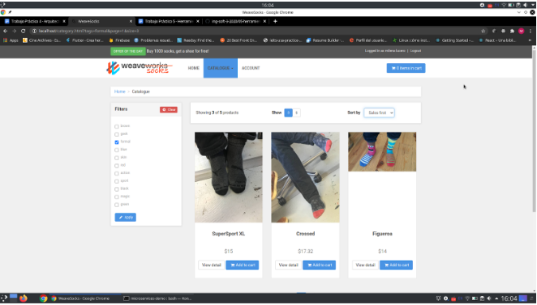
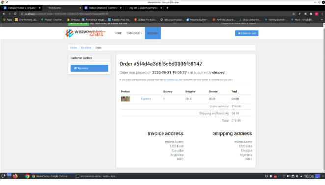
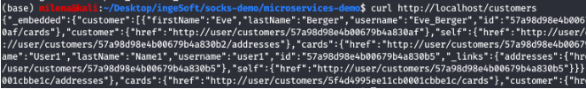
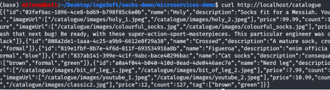
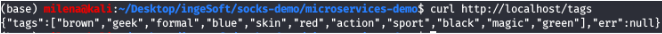

# Trabajo Practico N°4

## 1- Instanciación del sistema
`Clonar el repositorio https://github.com/microservices-demo/microservices-demo`
`mkdir -p socks-demo`
`cd socks-demo`
`git clone https://github.com/microservices-demo/microservices-demo.git`

* Ejecutar lo siguiente
* `cd microservices-demo`
* `docker-compose -f deploy/docker-compose/docker-compose.yml up -d`
* Una vez terminado el comando docker-compose acceder a http://localhost
* Generar un usuario
* Realizar búsquedas por tipo de media, color, etc.

  
  
* Hacer una compra - poner datos falsos de tarjeta de crédito ;)

## 2- Investigación de los componentes
* Describa los contenedores creados, indicando cuales son los puntos de ingreso del sistema

Los contenedores creados son:. 
    - Edge-router: unifica a todas las APIs. "IPAddress": "172.20.0.4"
    - Carts: vista del carro de compras. "IPAddress": "172.20.0.15"
    - Carts-db: base de datos del carro de compras del usuario. 
    - Queue-master: está en JAVA, "IPAddress": "172.20.0.5".  "Gateway": "172.20.0.1". Maneja la cola de mensajes. 
    - Shipping: servicio para el cobro del impuesto
    - Orders: maneja los pedidos del usuario, es una vista. 
    - User-db: base de datos de los usuarios registrados. 
    - User: vista de los usuarios. 
    - Payment
    - Catalogue-db: base de datos del catálogo
    - Rabbiting: middleware, que conecta las aplicaciones. 
    - Orders-db: base de datos de las órdebes
    - Front-end: es el controlador de las vistas. 
    - Catalogue: vista del catálogo de la aplicación. 
Los puntos de ingreso del sistema son edge-router, docker-compose_user_1, docker-compose_payment_1 y docker-compose_catalogue_1. 

* Clonar algunos de los repositorios con el código de las aplicaciones
* `cd socks-demo`
* `git clone https://github.com/microservices-demo/front-end.git`
* `git clone https://github.com/microservices-demo/user.git`
* `git clone https://github.com/microservices-demo/edge-router.git`
* **¿Por qué cree usted que se está utilizando repositorios separados para el código y/o la configuración del sistema? Explique puntos a favor y en contra.**

* A favor: 
Toda aplicación se compone entonces de 3 artefactos:
El código fuente.
La configuración.
Los scripts de despliegue.
Estos artefactos tienen un frecuencia de cambio distinta: el código fuente suele estar en constante modificación, mientras que los scripts de despliegue suelen ser mucho más estables y en algunos casos no recibir cambios por semanas o meses. La frecuencia de cambio de la configuración de la aplicación se encuentra en un punto intermedio, no está en constante cambio pero tampoco es tan estable como los scripts de despliegue.
Por otro lado, dependiendo del contexto organizacional, pueden definirse distintas políticas de acceso a estos artefactos. En algunas organizaciones es muy común que el equipo de desarrolladores no tenga permisos para acceder a los parámetros de configuración del ambiente productivo. También suele ocurrir que los scripts de despliegue de la aplicación sean administrados por personas ajenas al equipo de desarrolladores (usualmente personas del área de operaciones).
Estas dos cuestiones, frecuencia de cambio y permisos de acceso, son las que nos motivan a separar estos tres artefactos del proyecto en diferentes repositorios.

* En contra:
Separar los repositorios puede complicar a los desarrolladores y el personal de operaciones a descubrir el código de alguna función si no hay pautas y los nuevos repositorios no están vinculados entre sí como submódulos. 
Pueden generar barreras entre desarrolladores y operaciones. La operación y despliegue del código, los entornos permanentes, la configuración de los servicios, todo debe estar al alcance de los desarrolladores y con expectativas explícitas de desarrollar dicho código en coordinación con el equipo de operaciones.

* 4- **¿Cuál contenedor hace las veces de API Gateway?**
El contenedor del Front end es el API Gateway.

* 5- **Cuando ejecuto este comando**:
`curl http://localhost/customers`
* - **¿Cuál de todos los servicios está procesando la operación?**
El servicio que está procesando la operación es users, que me trae la información de los usuarios registrados en el sistema.

* 6- **¿Y para los siguientes casos?**
* `curl http://localhost/catalogue`
El servicio que procesa esta operación es catalogue. 

* `curl http://localhost/tags`
El servicio que procesa esta operación es tags. 

 

* 7- **¿Como perisisten los datos los servicios?**
La contenedores Carts-db, User-db, Catalogue-db, Orders-db, que son bases de datos que se encargan  de la persistencia.

* 8- **¿Cuál es el componente encargado del procesamiento de la cola de mensajes?**
Como nombramos anteriormente el `Queue-master`
* 9- **¿Qué tipo de interfaz utilizan estos microservicios para comunicarse?**
rabbitmq:3.6.8
