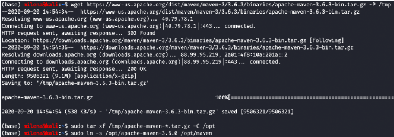
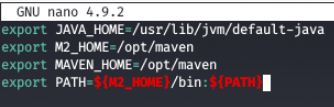
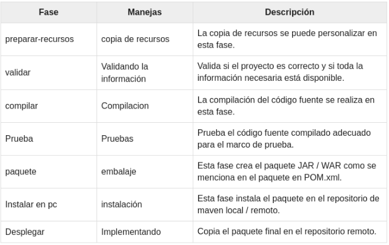
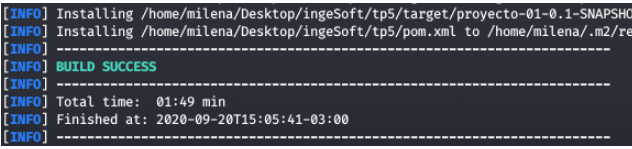

## Trabajo Práctico 5 - Herramientas de construcción de software
### 1- Objetivos de Aprendizaje
 - Utilizar herramientas de construcción de software y manejo de paquetes y dependencias
 - Familiarizarse con las herramientas más utilizadas en el lenguaje Java.

### Desarrollo:

#### 1- Instalar Java JDK si no dispone del mismo. 

#### 2- Instalar Maven
- Instalar maven desde https://maven.apache.org/download.cgi (última versión disponible 3.6.1)
- Descomprimir en una carpeta, por ejemplo C:\tools
- Agregar el siguiente directorio a la variable de entorno PATH, asumiendo que los binarios de ant están en C:\tools\apache-maven-3.6.1\bin

  ```bash   
    SET PATH=%PATH%;C:\tools\apache-maven-3.6.1\bin
  ```  
- Se puede modificar permanentemente la variable PATH entrando a (Winkey + Pausa -> Opciones Avanzadas de Sistema -> Variables de Entorno)
- En Linux/Mac se puede agregar la siguiente entrada al archivo ~/.bash_profile
  ```bash
  export PATH=/opt/apache-maven-3.6.1/bin:$PATH
  ```




#### 3- Introducción a Maven
- Qué es Maven? Maven es una herramienta de software para la gestión y construcción de proyectos Java.
- Qué es el archivo POM? 
El archivo POM es un archivo XML que contiene información sobre el proyecto y los detalles de configuración utilizados por Maven para construir el proyecto.

    1. modelVersion: indica qué versión del modelo de objetos está usando este POM. La versión del modelo en sí cambia con poca frecuencia, pero es obligatorio para garantizar la estabilidad de uso si los desarrolladores de Maven lo consideran necesario para cambiar el modelo.
    2. groupId: indica la estructura de paquetes del proyecto 
    3. artifactId: indica el el nombre del proyecto.
    4. versionId:  identifica la versión del proyecto. 
- Repositorios Local, Central y Remotos http://maven.apache.org/guides/introduction/introduction-to-repositories.html
- Entender Ciclos de vida de build
  - default
  - clean
  - site
  - Referencia: http://maven.apache.org/guides/introduction/introduction-to-the-lifecycle.html#Build_Lifecycle_Basics
  
  Un ciclo de vida de compilación es una secuencia de fases bien definida, que define el orden en el que se ejecutarán los objetivos. Un ciclo de vida de compilación típico de Maven consta de la siguiente secuencia de fases: ver photo-1.png

  

- Comprender las fases de un ciclo de vida, por ejemplo, default:

| Fase de build | Descripción                                                                                                                            |
|---------------|----------------------------------------------------------------------------------------------------------------------------------------|
| validate      | valida si el proyecto está correcto y toda la información está disponible                                                             |
| compile       | compila el código fuente del proyecto                                                                                 |
| test          | prueba el código fuente compilado utilizando un marco de prueba de unidad adecuado. Estas pruebas no deberían requerir que el código se empaquete o implemente |
| package       | toma el código compilado y lo empaqueta en su formato distribuible, como un JAR.                                                     |
| verify        | ejecuta cualquier verificación de los resultados de las pruebas de integración para garantizar que se cumplan los criterios de calidad                                                      |
| install       | instal1 el paquete en el repositorio local, para usarlo como dependencia en otros proyectos localmente                                       |
| deploy        | hecho en el entorno de compilación, copia el paquete final en el repositorio remoto para compartirlo con otros desarrolladores y proyectos.      |

Un objetivo representa una tarea específica que contribuye a la construcción y gestión de un proyecto. 
    - default: este es el ciclo de vida principal de Maven y se utiliza para construir la aplicación. 
    - clean: Cuando ejecutamos el comando mvn post-clean , Maven invoca el ciclo de vida clean que consta de las siguientes fases.
        pre-limpieza
        limpiar
        post-limpieza
        El objetivo clean de Maven (clean: clean) está ligado a la fase limpiar en el ciclo de vida clean. Su clean:clean goal elimina la salida de una compilación eliminando el directorio de compilación. Por lo tanto, cuando se ejecuta el comando mvn clean, Maven elimina el directorio de compilación.
    - site: se usa para crear documentación nueva para crear informes, implementar un sitio, etc. Tiene las siguientes fases:
        pre-sitio
        sitio
        post-sitio
        implementación del sitio

- Copiar el siguiente contenido a un archivo, por ejemplo ./trabajo-practico-02/maven/vacio/pom.xml

```xml
<project xmlns="http://maven.apache.org/POM/4.0.0"
         xmlns:xsi="http://www.w3.org/2001/XMLSchema-instance"
         xsi:schemaLocation="http://maven.apache.org/POM/4.0.0
                      http://maven.apache.org/xsd/maven-4.0.0.xsd">
    <modelVersion>4.0.0</modelVersion>

    <groupId>ar.edu.ucc</groupId>
    <artifactId>proyecto-01</artifactId>
    <version>0.1-SNAPSHOT</version>
</project>
```

- Ejecutar el siguiente comando en el directorio donde se encuentra el archivo pom.xml
```
mvn clean install
```

- Sacar conclusiones del resultado
Se ejecuta correctamente y se hace un build exitoso. 



#### 4- Maven Continuación

- Generar un proyecto con una estructura inicial:

```bash
mvn archetype:generate -DgroupId=ar.edu.ucc -DartifactId=ejemplo -DarchetypeArtifactId=maven-archetype-quickstart -DinteractiveMode=false
```

- Analizar la estructura de directorios generada:

```
.
└── ejemplo
    ├── pom.xml
    └── src
        ├── main
        │   └── java
        │       └── ar
        │           └── edu
        │               └── ucc
        │                   └── App.java
        └── test
            └── java
                └── ar
                    └── edu
                        └── ucc
                            └── AppTest.java

12 directories, 3 files
```

El proyecto se divide en dos carpetas en src, main, que contiene el codigo principal de la aplicación, y test, que contiene los unit tests de la aplicación. 

- Compilar el proyecto

```bash
mvn clean package
```

- Analizar la salida del comando anterior y luego ejecutar el programa

```
java -cp target/ejemplo-1.0-SNAPSHOT.jar ar.edu.ucc.App
```

#### 6- Manejo de dependencias

- Crear un nuevo proyecto con artifactId **ejemplo-uber-jar**

- Modificar el código de App.java para agregar utilizar una librería de logging:

```java
package ar.edu.ucc;

import org.slf4j.Logger;
import org.slf4j.LoggerFactory;

/**
 * Hello world!
 *
 */
public class App 
{
    public static void main( String[] args )
    {
        Logger log = LoggerFactory.getLogger(App.class);
        log.info("Hola Mundo!");
    }
}
```

- Compilar el código e identificar el problema.

- Agregar la dependencia necesaria al pom.xml

```xml
    <dependency>
      <groupId>ch.qos.logback</groupId>
      <artifactId>logback-classic</artifactId>
      <version>1.2.1</version>
    </dependency>
```

- Verificar si se genera el archivo jar y ejecutarlo

```bash
java -cp target\ejemplo-uber-jar-1.0-SNAPSHOT.jar ar.edu.ucc.App
```

- Sacar conclusiones y analizar posibles soluciones

- Implementar la opción de uber-jar: https://maven.apache.org/plugins/maven-shade-plugin/

```xml
  <build>
    <plugins>
      <plugin>
        <groupId>org.apache.maven.plugins</groupId>
        <artifactId>maven-shade-plugin</artifactId>
        <version>2.0</version>
        <executions>
          <execution>
            <phase>package</phase>
            <goals>
              <goal>shade</goal>
            </goals>
            <configuration>
              <finalName>${project.artifactId}</finalName>
              <transformers>
                <transformer implementation="org.apache.maven.plugins.shade.resource.ManifestResourceTransformer">
                  <mainClass>ar.edu.ucc.App</mainClass>
                </transformer>
              </transformers>
              <minimizeJar>false</minimizeJar>
            </configuration>
          </execution>
        </executions>
      </plugin>
    </plugins>
  </build>
```
- Volver a generar la salida y probar ejecutando

```bash
java -jar target\ejemplo-uber-jar.jar
```

#### 7- Utilizar una IDE
  - Importar el proyecto anterior en Eclipse o Intellij como maven project:
    - Si no dispone de Eclipse puede obtenerlo desde este link http://www.eclipse.org/downloads/packages/release/2018-09/r/eclipse-ide-java-ee-developers
    - Para importar, ir al menú Archivo -> Importar -> Maven -> Proyecto Maven Existente:

    - Seleccionar el directorio donde se encuentra el pom.xml que se generó en el punto anterior. Luego continuar:


  - Familiarizarse con la interfaz grafica
    - Ejecutar la aplicación
    - Depurar la aplicación
    - Correr unit tests y coverage
    - Ejecutar los goals de maven
    - Encontrar donde se puede cambiar la configuración de Maven.
    - etc.

#### 8- Ejemplo con nodejs

- Instalar Nodejs: https://nodejs.org/en/

- Instalar el componente para generar aplicaciones Express

```bash
npm install express-generator -g
```

- Crear una nueva aplicación
```bash
express --view=ejs hola-mundo
```

- Ejecutar la aplicación

```bash
cd hola-mundo
npm install
npm start
```

- La aplicación web estará disponible en http://localhost:3000

- Analizar el manejo de paquetes y dependencias realizado por npm.
El gestor de paquetes npm instala localmente paquetes en los proyectos; al descargarse un módulo, se agrega a un proyecto local, que es el que lo tendrá disponible para incluir. Se puede descargar globalmente un paquete usando la flag -g. Npm instala los paquetes dentro de node_modules y todo lo que está en esa carpeta se encuentra disponible para require() sin necesidad de decirle la ruta exacta para llegar.
Cada paquete tiene entre su código un archivo package.json que contiene en notación JSON los datos del paquete en sí. Es como una tarjeta de identificación del paquete, que puede servir para informarte a ti mismo y a cualquier sistema informático de sus características. 


#### 9- Ejemplo con python
- Instalar dependencias (Ejemplo Ubuntu) varía según el OS:
```
sudo apt install build-essential python3-dev
pip3 install cookiecutter
```
- Correr el scaffold
```bash
$ cookiecutter https://github.com/candidtim/cookiecutter-flask-minimal.git
application_name [Your Application]: test
package_name [yourapplication]: test
$
```
- Ejecutar la aplicación
```bash
cd test
make run
```
- Acceder a la aplicación en: http://localhost:5000/
- Explicar que hace una tool como cookiecutter, make y pip.

#### Cookiecutter
Cookiecutter proporciona una interfaz gráfica de usuario para descubrir plantillas, opciones de plantilla de entrada y crear proyectos y archivos. 
Lo que hace es tomar un árbol de directorio de origen y lo copia en su nuevo proyecto. Reemplaza todos los nombres que encuentra rodeados de etiquetas de plantilla {{ y }} por los nombres que encuentra en el archivo cookiecutter.json. Los nombres reemplazados pueden ser nombres de archivos, nombres de directorios y cadenas dentro de los archivos.
Con Cookiecutter, puede iniciar fácilmente un nuevo proyecto desde un formato estándar, lo que significa que se saltea todos los errores habituales al iniciar un nuevo proyecto.

#### Make
Un archivo MAKE es un archivo especial, que contiene comandos de shell, que usted crea y nombra archivo MAKE (o Makefile dependiendo del sistema). Mientras esté en el directorio que contiene este archivo MAKE, escriba make y se ejecutarán los comandos del archivo MAKE. Si crea más de un archivo MAKE, asegúrese de estar en el directorio correcto antes de escribir make.
Make realiza un seguimiento de la última vez que se actualizaron los archivos (normalmente archivos de objetos) y solo actualiza los archivos que son necesarios (los que contienen cambios) para mantener el archivo fuente actualizado. Si tiene un programa grande con muchos archivos de origen y / o encabezado, cuando cambie un archivo del que dependan otros, debe volver a compilar todos los archivos dependientes. Sin un archivo MAKE, esta es una tarea que consume mucho tiempo.

#### Pip
pip es el administrador de paquetes estándar para Python. Le permite instalar y administrar paquetes adicionales que no forman parte de la biblioteca estándar de Python.

#### 10- Build tools para otros lenguajes
Groovy: Gradle
Python:
R:
Ruby:
Dart:
Javascript:
Go:
SQL:
C++:
Typescript: 

