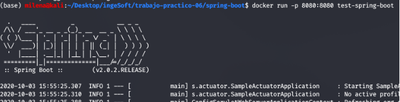
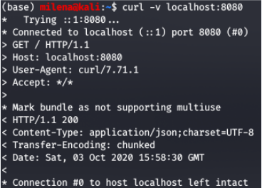
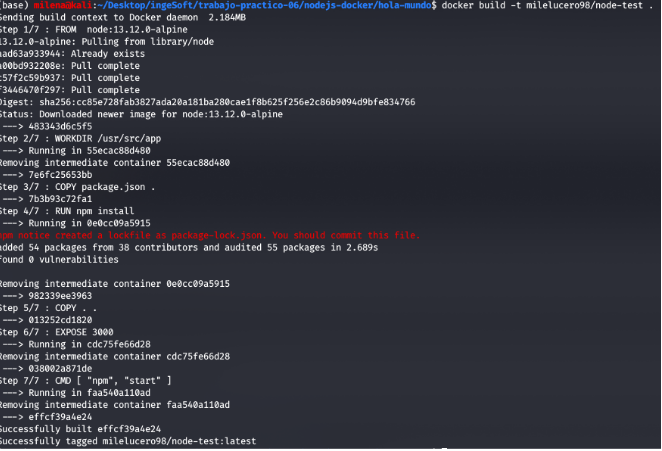
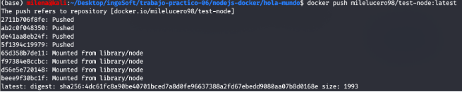
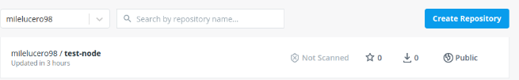

## Trabajo Práctico 6 - Construcción de Imágenes de Docker

### Objetivos de Aprendizaje
 - Adquirir conocimientos para construir y publicar imágenes de Docker.
 - Familiarizarse con el vocabulario.

### Desarrollo:

#### Conceptos de Dockerfiles
  - Describir las instrucciones
     - FROM: 
     Inicializa una nueva etapa de construcción y establece la imagen base para instrucciones posteriores. Como tal, un Dockerfile válido debe comenzar con una instrucción FROM. La imagen puede ser cualquier imagen válida; es especialmente fácil comenzar extrayendo una imagen de los repositorios públicos.

     - RUN: 
     Ejecutará cualquier comando en una nueva capa sobre la imagen actual y confirmará los resultados. La imagen comprometida resultante se utilizará para el siguiente paso en Dockerfile.

     - ADD: 
     Copia nuevos archivos, directorios o URL de archivos remotos <src> y los agrega al sistema de archivos de la imagen en la ruta <dest>.

     - COPY: 
     La instrucción COPY copia nuevos archivos o directorios de <src> y los agrega al sistema de archivos del contenedor en la ruta <dest>. Se pueden especificar varios recursos <src> pero las rutas de archivos y directorios se interpretarán como relativas a la fuente del contexto de la compilación.

     - EXPOSE: 
     La instrucción EXPOSE informa a Docker que el contenedor escucha en los puertos de red especificados en tiempo de ejecución. Puede especificar si el puerto escucha en TCP o UDP, y el valor predeterminado es TCP si no se especifica el protocolo. La instrucción EXPOSE no publica realmente el puerto. Funciona como un tipo de documentación entre la persona que construye la imagen y la persona que ejecuta el contenedor, sobre qué puertos se pretenden publicar.

     - CMD: 
     El objetivo principal de una CMD es proporcionar valores predeterminados para un contenedor en ejecución. Estos valores predeterminados pueden incluir un ejecutable, o pueden omitir el ejecutable, en cuyo caso también debe especificar una instrucción ENTRYPOINT.

     - ENTRYPOINT: 
     Un ENTRYPOINT le permite configurar un contenedor que se ejecutará como ejecutable.

#### Generar imagen de docker
   - Clonar/Actualizar el repositorio de https://github.com/alexisfr/ing-soft-3-2020 
   - El código se encuentra en la carpeta `./proyectos/spring-boot`
   - Se puede copiar al repositorio personal en una carpeta `trabajo-practico-06/spring-boot`
   - Compilar la salida con:
```bash
cd proyectos/spring-boot
mvn clean package spring-boot:repackage  
```
   - Agregar un archivo llamado **Dockerfile** (en el directorio donde se corrió el comando mvn)
```Dockerfile
FROM java:8-jre-alpine

RUN apk add --no-cache bash

WORKDIR /app

COPY target/*.jar ./spring-boot-application.jar

ENV JAVA_OPTS="-Xms32m -Xmx128m"
EXPOSE 8080

ENTRYPOINT exec java $JAVA_OPTS -Djava.security.egd=file:/dev/./urandom -jar spring-boot-application.jar
```
   - Generar la imagen de docker con el comando build
```bash
docker build -t test-spring-boot .
```
  - Ejecutar el contenedor
```bash
docker run -p 8080:8080 test-spring-boot
```
  - Capturar y mostrar la salida.
  
 
 
  - Verificar si retorna un mensaje (correr en otro terminal o browser)
```bash
curl -v localhost:8080
```
 

#### Dockerfiles Multi Etapas
Se recomienda crear compilaciones de varias etapas para todas las aplicaciones (incluso las heredadas). En resumen, las compilaciones de múltiples etapas:

- Son independientes y auto descriptibles
- Resultan en una imagen de Docker muy pequeña
- Puede ser construido fácilmente por todas las partes interesadas del proyecto (incluso los no desarrolladores)
- Son muy fáciles de entender y mantener.
- No requiere un entorno de desarrollo (aparte del código fuente en sí)
- Se puede empaquetar con pipelines muy simples

Las compilaciones de múltiples etapas también son esenciales en organizaciones que emplean múltiples lenguajes de programación. La facilidad de crear una imagen de Docker por cualquier persona sin la necesidad de JDK / Node / Python / etc. no puede ser sobrestimado.

- Modificar el dockerfile para el proyecto Java anterior de la siguiente forma
```dockerfile
FROM maven:3.5.2-jdk-8-alpine AS MAVEN_TOOL_CHAIN
COPY pom.xml /tmp/
RUN mvn -B dependency:go-offline -f /tmp/pom.xml -s /usr/share/maven/ref/settings-docker.xml
COPY src /tmp/src/
WORKDIR /tmp/
RUN mvn -B -s /usr/share/maven/ref/settings-docker.xml package

FROM java:8-jre-alpine

EXPOSE 8080

RUN mkdir /app
COPY --from=MAVEN_TOOL_CHAIN /tmp/target/*.jar /app/spring-boot-application.jar

ENV JAVA_OPTS="-Xms32m -Xmx128m"

ENTRYPOINT exec java $JAVA_OPTS -Djava.security.egd=file:/dev/./urandom -jar /app/spring-boot-application.jar

HEALTHCHECK --interval=1m --timeout=3s CMD wget -q -T 3 -s http://localhost:8080/actuator/health/ || exit 1
```
- Construir nuevamente la imagen
```bash
docker build -t test-spring-boot .
```
- Analizar y explicar el nuevo Dockerfile, incluyendo las nuevas instrucciones.

FROM maven:3.5.2-jdk-8-alpine AS MAVEN_TOOL_CHAIN 
Se le asigna una variable global MAVEN_TOOL_CHAIN para no tener que modificar el archivo en caso de que se deba cambiar la imagen. 

COPY pom.xml /tmp/
Copia el archivo pom.xml en un directorio temporal.

RUN mvn -B dependency:go-offline -f /tmp/pom.xml -s /usr/share/maven/ref/settings-docker.xml
Ejecuta el pom.xml con el comando mvn y lo comparte en otro archivo de configuracion llamado settings-docker.xml

COPY src /tmp/src/
Copia el contenido de la carpeta tmp/src

WORKDIR /tmp/
Establece el directorio tmp como workdirectory

RUN mvn -B -s /usr/share/maven/ref/settings-docker.xml package
Corre el comando mvn en el setting-docker.xml 

FROM java:8-jre-alpine
Utiliza una imagen de java

EXPOSE 8080
Expone el puerto 8080

RUN mkdir /app
Crea un directorio /app para la aplicación

COPY --from=MAVEN_TOOL_CHAIN /tmp/target/*.jar /app/spring-boot-application.jar
Copia cualquier archivo .jar que se encuentra en el directorio tmp/target de MAVEN_TOOL_CHAIN

ENV JAVA_OPTS="-Xms32m -Xmx128m"
Establece las variable de entorno, asignando el espacio designado para el contenedor

ENTRYPOINT exec java $JAVA_OPTS -Djava.security.egd=file:/dev/./urandom -jar /app/spring-boot-application.jar
Crea un punto de acceso para la aplicación, ejecutando la app con las variables de entorno predefinidas. 

HEALTHCHECK --interval=1m --timeout=3s CMD wget -q -T 3 -s http://localhost:8080/actuator/health/ || exit 1
Hace una prueba para ver que la app esté funcionando correctamente. 

#### Python Flask
  - Utilizar el código que se encuentra en la carpeta `./proyectos/python-flask`
  - Se puede copiar al repositorio personal en una carpeta `trabajo-practico-06/python-flask`
  - Correr el comando
```bash
cd ./proyectos/python-flask
docker-compose up -d
```
  - Explicar que sucedió. 
  Docker Compose ejecutó el Dockerfile para instalar python en el contenedor donde luego, se construyó la aplicación, agregando una etiqueta a la imagen recién creada. 

  - ¿Para qué está la key `build.context` en el docker-compose.yml?
  El contexto de compilación es el conjunto de archivos ubicados en la RUTA o URL especificada. Estos archivos se envían al demonio de Docker durante la compilación para que pueda usarlos en el sistema de archivos de la imagen.


#### Imagen para aplicación web en Nodejs
  - Crear una la carpeta `trabajo-practico-06/nodejs-docker`
  - Generar un proyecto siguiendo los pasos descriptos en el trabajo práctico 5 para Nodejs
  - Escribir un Dockerfile para ejecutar la aplicación web localizada en ese directorio
    - Idealmente que sea multistage, con una imagen de build y otra de producción.
    - Usar como imagen base **node:13.12.0-alpine**
    - Ejecutar **npm install** dentro durante el build.
    - Exponer el puerto 3000
  - Hacer un build de la imagen, nombrar la imagen **test-node**.
  - Ejecutar la imagen **test-node** publicando el puerto 3000.
  - Verificar en http://localhost:3000 que la aplicación está funcionando.
  - Proveer el Dockerfile y los comandos ejecutados como resultado de este ejercicio.
  
  ```bash
  
FROM  node:13.12.0-alpine

WORKDIR /usr/src/app

COPY package.json .
RUN npm install

COPY . .

EXPOSE 3000
CMD [ "npm", "start" ]

```


#### 6- Publicar la imagen en Docker Hub.
  - Crear una cuenta en Docker Hub si no se dispone de una.
  - Registrase localmente a la cuenta de Docker Hub:
  
```bash
docker login
```
  - Crear un tag de la imagen generada en el ejercicio 3. Reemplazar <mi_usuario> por el creado en el punto anterior.
```bash
docker tag test-node <mi_usuario>/test-node:latest
```
  - Subir la imagen a Docker Hub con el comando
```bash
docker push <mi_usuario>/test-node:latest
``` 
  - Como resultado de este ejercicio mostrar la salida de consola, o una captura de pantalla de la imagen disponible en Docker Hub. 


