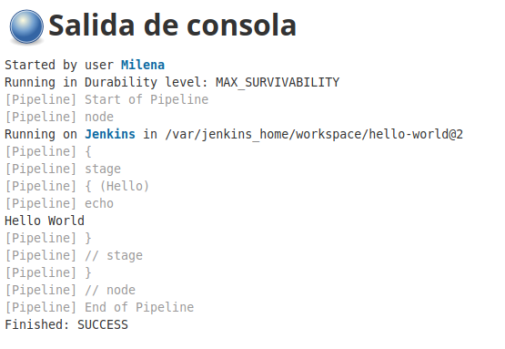
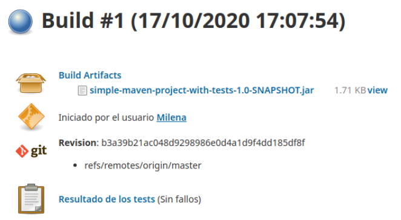
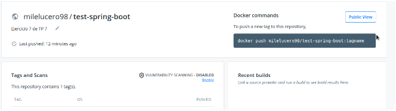

## Trabajo Práctico 7 - Servidor de Build (de integración continua).

### Desarrollo:

#### Creando el primer Pipeline Job
  - Crear un nuevo item, del tipo Pipeline con nombre **hello-world**
  - Una vez creado el job, en la sección Pipeline seleccionamos **try sample Pipeline** y luego **Hello World**
  - Guardamos y ejecutamos el Job
  - Analizar la salida del mismo
 
 
 
 
 
 Los steps del job se ejecutan de forma exitosa. 
 
#### Creando un Pipeline Job con Git y Maven
  - Similar al paso anterior creamos un ítem con el nombre **simple-maven**
  - Elegir **Git + Maven** en la sección **try sample Pipeline**
  - Guardar y ejecutar el Job
  - Analizar el script, para identificar los diferentes pasos definidos y correlacionarlos con lo que se ejecuta en el Job y se visualiza en la página del Job.
  
 
  
```bash

Script:
pipeline {
    agent any
 
    tools {
        // Install the Maven version configured as "M3" and add it to the path.
        maven "M3"
    }
 
    stages {
        stage('Build') {
            steps {
                // Get some code from a GitHub repository
                git 'https://github.com/jglick/simple-maven-project-with-tests.git'
 
                // Run Maven on a Unix agent.
                sh "mvn -Dmaven.test.failure.ignore=true clean package"
 
                // To run Maven on a Windows agent, use
                // bat "mvn -Dmaven.test.failure.ignore=true clean package"
            }
 
            post {
                // If Maven was able to run the tests, even if some of the test
                // failed, record the test results and archive the jar file.
                success {
                    junit '**/target/surefire-reports/TEST-*.xml'
                    archiveArtifacts 'target/*.jar'
                }
            }
        }
    }
}

```

Los pasos definidos son: 
Trae código de Github, de un repositorio particular.
Corre Maven y compila el proyecto, ignorando los tests fallidos. 
Si se corre exitosamente, que publique un Artifact, que serían los resultados de los tests y el archivo jar. 

#### Utilizando nuestros proyectos
  - Utilizando lo aprendido en el ejercicio 5
    - Crear un Job que construya el proyecto **spring-boot** del [trabajo práctico 6](06-construccion-imagenes-docker.md).
    - Obtener el código desde el repositorio de cada alumno (se puede crear un repositorio nuevo en github que contenga solamente el proyecto maven).
    - Generar y publicar los artefactos que se producen.
  - Como resultado de este ejercicio proveer el script en un archivo **spring-boot/Jenkinsfile**
  

```bash

pipeline {
    agent any

    tools {
        maven "M3"
    }

    stages {
        stage('Build') {
            steps {

                git 'https://github.com/MilenaL2018/spring-boot-tp7.git'

                sh "mvn -Dmaven.test.failure.ignore=true clean package"
            }

            post {
                success {
                    junit '**/target/surefire-reports/TEST-*.xml'
                    archiveArtifacts 'target/*.jar'
                }
            }
        }
    }
} 

```


#### Utilizando nuestros proyectos con Docker
  - Extender el ejercicio 6
  - Generar y publicar en Dockerhub la imagen de docker ademas del Jar.
  - Se puede utilizar el [plugin de docker](https://docs.cloudbees.com/docs/admin-resources/latest/plugins/docker-workflow) o comandos de shell.
  - No poner usuario y password en el pipeline en texto plano, por ejemplo para conectarse a DockerHub, utilizar [credenciales de jenkins](https://github.com/jenkinsci/credentials-plugin/blob/master/docs/user.adoc) en su lugar.
  - Como resultado de este ejercicio proveer el script en un archivo **spring-boot/Jenkinsfile**

```bash

pipeline {
    environment {
        registry = "milelucero98/test-spring-boot"
        registryCredential = 'docker-hub-credentials'
        dockerImage = ''
    }
    agent any
    stages {
        stage('Clone Git') {
            steps {
                git 'https://github.com/MilenaL2018/spring-boot-tp7.git'
            }
        }
        stage('Build image') {
            steps {
                script {
                    dockerImage = docker.build registry + ":$BUILD_NUMBER"
                }
            }
            
            post {
                success {
                    junit '**/target/surefire-reports/TEST-*.xml'
                    archiveArtifacts 'target/*.jar'
                }
            }
        }
        stage('Deploy image') {
            steps {
                script {
                    docker.withRegistry( '', registryCredential ) {
                        dockerImage.push()
                    }
                }
            }
        }
        stage('Cleaning up') {
            steps { 
                sh "docker rmi $registry:$BUILD_NUMBER" 
            }
        } 
    }
}


```

 
